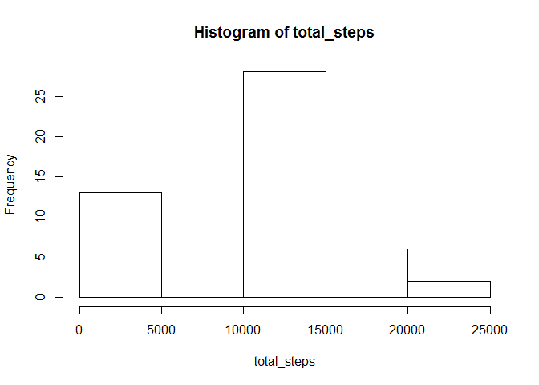
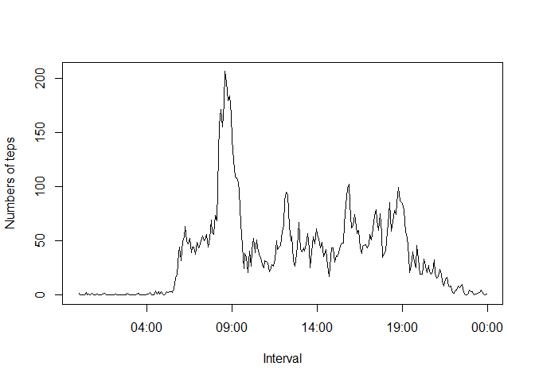
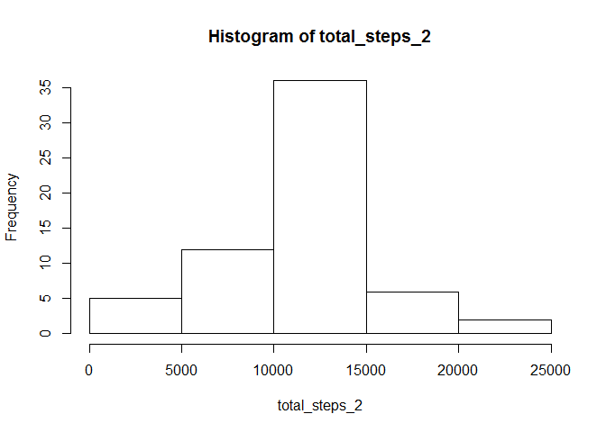
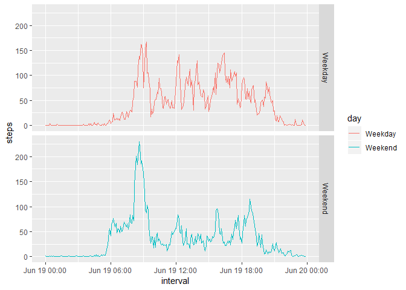

## Loading and preprocessing the data

```r
library(dplyr)
```

```
## 
## Attaching package: 'dplyr'
```

```
## The following objects are masked from 'package:stats':
## 
##     filter, lag
```

```
## The following objects are masked from 'package:base':
## 
##     intersect, setdiff, setequal, union
```

```r
library(ggplot2)
data<-read.csv(unz("repdata_data_activity.zip","activity.csv"))
data$date<-as.Date(as.character(data$date),"%Y-%m-%d")
data$interval<-sprintf("%04d",data$interval)
```
## What is mean total number of steps taken per day?

```r
total_steps<-with(data,tapply(steps,date,sum,na.rm=TRUE))
hist(total_steps)
```

<!-- -->

```r
mean_steps<-round(mean(total_steps))
median_steps<-median(total_steps)
```
The mean total steps per day is 9354. 
The median total steps per day is 10395. 

## What is the average daily activity pattern?

```r
daily<-with(data,tapply(steps,interval,mean,na.rm=TRUE))
plot(strptime(names(daily),"%H%M"),daily,type="l",xlab="Interval",ylab="Numbers of teps")
```

<!-- -->

```r
index<-names(which.max(daily))
max_step<-round(max(daily))
```
The interval 0835 contains max number of steps which is 206.

## Imputing missing values

```r
No_of_missing<-sum(is.na(data$steps))

#the missing data will be imputed with the mean of that 5-min #interval
missing<-is.na(data$steps)
data[missing,]$steps<-daily[data[missing,]$interval]
```
The number of missing value is 2304.


```r
total_steps_2<-with(data,tapply(steps,date,sum))
hist(total_steps_2)
```

<!-- -->

```r
mean_steps<-round(mean(total_steps_2))
median_steps<-median(total_steps_2)
```
The mean total steps per day is 1.0766\times 10^{4}. 
The median total steps per day is 1.0766189\times 10^{4}. 

## Are there differences in activity patterns between weekdays and weekends?

```r
#create new factor variable with two levels: "Weekday","Weekend"
days<-unique(weekdays(data$date))
data<-transform(data,day=factor(weekdays(data$date) %in% days[1:5])) 
levels(data$day)<-c("Weekday","Weekend")

plotdata<-data %>% group_by(day,interval) %>% summarize(steps=mean(steps))
plotdata$interval<-as.POSIXct(plotdata$interval,format="%H%M")

ggplot(plotdata,aes(interval,steps,color=day))+geom_line()+facet_grid(day~.)
```

<!-- -->


